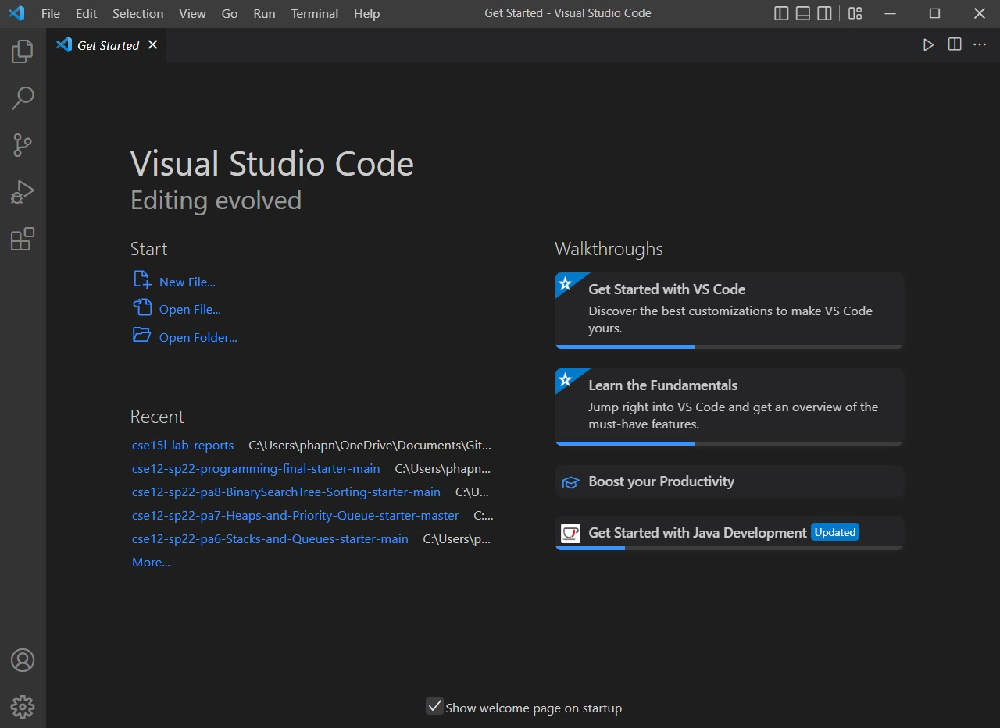
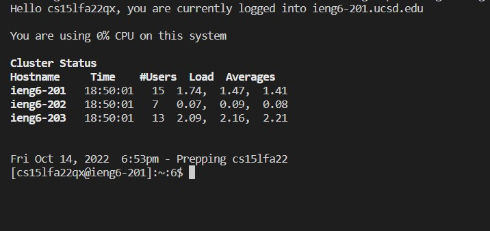
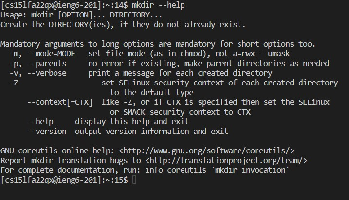
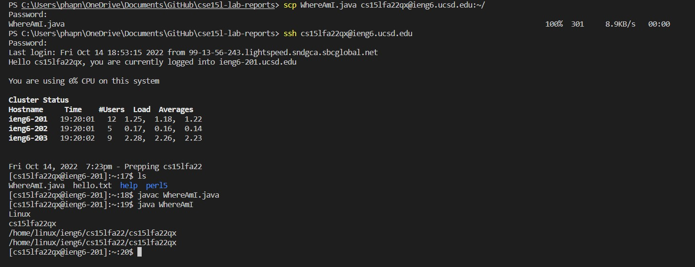
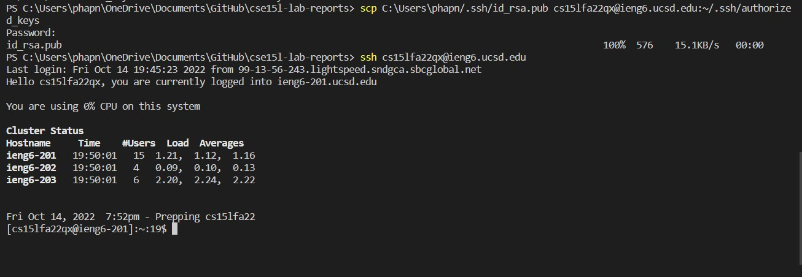
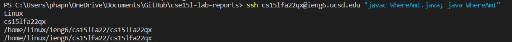

# Week 1 Lab Report: Remote Access and the Filesystem

## Pre-task: Have your CSE15L account ready and make sure your local computer has OpenSSH 

* Check if your computer has OpenSSH installed. If not, install it [here](https://learn.microsoft.com/en-us/windows-server/administration/openssh/openssh_install_firstuse?tabs=gui).
* Look up your CSE15L [here](https://sdacs.ucsd.edu/~icc/index.php) and reset the account password.

## Step 1: Installing VSCode in your local computer
VSCode has the terminal that allow you to access your remote system. Open your browser and go to the official website for VSCode [here](https://code.visualstudio.com/). Select the right version for your OS, install it and set it up on your computer. 

Once you are finished, the program  should look similar to this:

## Step 2: Connecting to your remote system

Run VSCode and open a new terminal. Enter the following command:

    ssh your_CSE15L_account@ieng6.ucsd.edu

Remember to replace your_CSE15L_account with your actual account. If you enter it correctly, the terminal will ask for your password. Enter the password and you should be able to log in.

After sucessfully logging in, you should see a message like this in your terminal:

## Step 3: Running some commands

Now that you have connected into the remote server, here is a list of some useful commands that you could try: 

* cd
* ls
* pwd 
* mkdir
* cp
* exit

If you are not sure what these commands do, you can add the --help after each command to check out the documentation. You can also run these commands on your local computer at well to see the different they make comparing to run them on the remote server. Below is an example of me running the mkdir --help command on the server:

After finish using the server, you can log out by using Ctrl - D or run the command exit in the terminal.

## Step 4: Moving Files with scp

The command scp can be used to to copy a file (or many files) from your computer to a remote computer. This command is always run in the client (your computer), so make sure you have logged out of the server before doing this. Create a file on your computer called WhereAmI.java and put the following contents into it:

    class WhereAmI {
        public static void main(String[] args) {
        System.out.println(System.getProperty("os.name"));
        System.out.println(System.getProperty("user.name"));
        System.out.println(System.getProperty("user.home"));
        System.out.println(System.getProperty("user.dir"));
        }
    }
Then, in the terminal from the directory where you made this file, run this command to copy the file to the remote computer. You will be asked for your password:

    scp WhereAmI.java your_CSE15L_account@ieng6.ucsd.edu:~/

Once you are done, logging to the server using ssh. Run the command ls the file there in your home directory. Now, you should be able to run the file on the server without any issues. Here is an example of me doing all the steps:

## Step 5: Setting an SSH Key
Having to log in everytime we run ssh and scp could be time-consuming. Therefore, we can a program called ssh-keygen, creates a pair of files called the public key and private key. You can set it up by running the following command on your computer:

    C:\Users\phapn\OneDrive\Documents\GitHub\cse15l-lab-reports> ssh-keygen
    Generating public/private rsa key pair.
    Enter file in which to save the key (C:\Users\phapn/.ssh/id_rsa): 
    Enter passphrase (empty for no passphrase): 
    Enter same passphrase again: 
    Your identification has been saved in C:\Users\phapn/.ssh/id_rsa.
    Your public key has been saved in C:\Users\phapn/.ssh/id_rsa.pub.
    The key fingerprint is:
    SHA256:VjfUSqEeiqFPuvEzBFTU9IkOr+R/SPb41NNUiDSJ1Fg phapn@DESKTOP-4U7DD7G
    The key's randomart image is:
    +---[RSA 3072]----+
    |     ooo...=E+   |
    |    .   .oo=+o.. |
    |   .  o . *.+.. .|
    |    .. * + o.. . |
    |    ..+ S .   .  |
    |     *.oo  . o   |
    |    o.+o +. o .  |
    |     +o.o.o  .   |
    |    . .o.o.      |
    +----[SHA256]-----+
This created two new files on your system; the private key (in a file id_rsa) and the public key (in a file id_rsa.pub), stored in the .ssh directory on your computer.

We need to copy the public key to the .ssh directory of your CSE15L account on the server:

    # on client
    $ ssh your_CSE15L_account@ieng6.ucsd.edu
    <Enter Password>

    # now on server
    $ mkdir .ssh
    $ <logout>

    # back on client
    $ scp C:\Users\phapn/.ssh/id_rsa.pub cs15lfa22qx@ieng6.ucsd.edu:~/.ssh/authorized_keys
    # You use your username and the path you saw in the command above

Below is an image of me sucessfully do all the steps so I am no longer need to type in password when I use the ssh and scp command. 

## Step 6: Optimizing Remote Running 

Here is a few tip to optimize remote running that you may find helpful:

* Write a command in quotes at the end of an ssh command to directly run it on the remote server, then exit.
* Use semicolons to run multiple commands on the same line.
* Use the up-arrow to recall the last command that was run.

For example, from my local computer, I can compile and run the WhereAmI.java on the remote server using only a single line of command:

