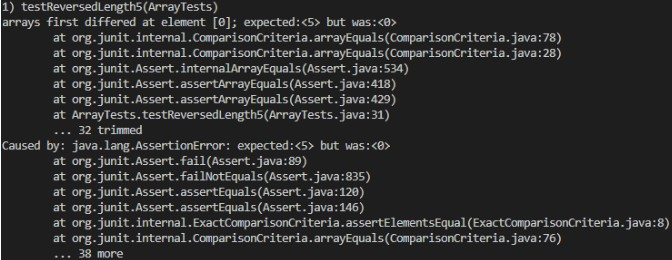

# Week 3 Lab Report
## Part 1: Simplest Search Engine

    import java.io.IOException;
    import java.net.URI;
    import java.util.ArrayList;
    import java.util.Arrays;

    class Handler implements URLHandler {
        // The one bit of state on the server: a number that will be manipulated by
        // various requests.
        String data;
        ArrayList<String> database = new ArrayList<>();

        public String handleRequest(URI url) {
            if (url.getPath().contains("/add")) {
                String[] parameters = url.getQuery().split("=");
                database.add(parameters[1]);
                return "Add successfully";
            } else if (url.getPath().contains("/search")){
                if (database.size() == 0)
                    return "Database is empty";
                else
                {
                    String[] parameters = url.getQuery().split("=");
                    ArrayList<String> result = new ArrayList<>();
                    for (String string: database)
                    {
                        if (string.contains(parameters[1]))
                        {
                            result.add(string);
                        }

                    }
                    System.out.println(Arrays.toString(result.toArray()));
                    return "Result";
                }
            } else 
                return "404 not found";            
        }
    }

    class SearchEngine {
        public static void main(String[] args) throws IOException {
            if(args.length == 0){
                System.out.println("Missing port number! Try any number between 1024 to 49151");
                return;
            }

            int port = Integer.parseInt(args[0]);

            Server.start(port, new Handler());
        }
    }

This is my approach with the SearchEngine method so far. However, the code cannot compile because of this error and I am not sure what cause it so I still do not how to debug it. 

    C:\Users\phapn\OneDrive\Documents\GitHub\wavelet> javac SearchEngine.java
    SearchEngine.java:6: error: cannot find symbol
    class Handler implements URLHandler {
                            ^
    symbol: class URLHandler
    SearchEngine.java:49: error: incompatible types: Handler cannot be converted to URLHandler
            Server.start(port, new Handler());
                            ^
    Note: Some messages have been simplified; recompile with -Xdiags:verbose to get full output
    2 errors

## Part 2: Debugging
### Reversed method from ArrayExample.java:
* Failure inducing inputs:

* Symptoms: 

* Bug:

* Connection between the symptom and the bug: 

In the code snippet above that causing the bug, by assigning the value at the end index to the front index, the value at the front index would be lost. 

Futhermore, the code returns the arr instead of the newArr. And since the newArr is not initialized nor contain any values, the code only create a newArr with the length of arr. 

All of this bugs cause produce the program's unwanted behavior as seen in the symptom above. 

### Merge method from ListExamples.java

* Failure inducing inputs:

* Symptom:

* Bug:

* Connection between the symptom and the bug: 

In the code snippet above, by increment the index1 instead of the index2, the index2 would always satisfy the while loop condition, making the loop never get terminated. Therefore, the bug causes the program to go inside an infinite loop, which eventually produce the run out of memory error.