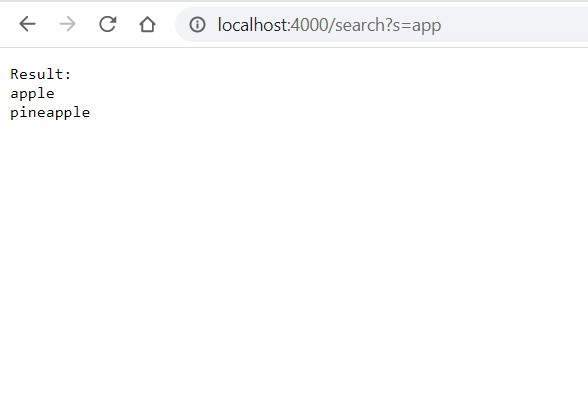

# Week 3 Lab Report
## Part 1: Simplest Search Engine

    import java.io.IOException;
    import java.net.URI;
    import java.util.List;
    import java.util.ArrayList;

    class Handler implements URLHandler {
        List<String> database = new ArrayList<>();

        public String handleRequest(URI url) {
            if (url.getPath().equals("/")) {
                return String.format("There are %d total items to search.", database.size());
            }
            else if (url.getPath().contains("/add")) {
                String[] parameters = url.getQuery().split("=");
                database.add(parameters[1]);
                return "Add successfully!";
            } else if (url.getPath().contains("/search")){
                if (database.size() == 0)
                    return "Database is empty";
                else
                {
                    String[] parameters = url.getQuery().split("=");
                    List<String> result = new ArrayList<>();
                    String found = "";
                    for (String s: database)
                    {
                        if (s.contains(parameters[1]))
                        {
                            result.add(s);
                        }

                    }
                    if (result.size() > 0) {
                        found = String.join("\n", result);
                        return String.format("Result: \n%s", found);
                    }
                    else    
                        return "Not found";
                }
            } else 
                return "404 not found";            
        }
    }

    class SearchEngine {
        public static void main(String[] args) throws IOException {
            if(args.length == 0){
                System.out.println("Missing port number! Try any number between 1024 to 49151");
                return;
            }

            int port = Integer.parseInt(args[0]);

            Server.start(port, new Handler());
        }
    }

* The Search Engine when adding a new string:

The code first calls getPath() and contain("/add") on the url object to retrieve the path and check whether there is an adding request. If there is, the code then invokes getQuery() and split() on the url object to process the path and get the adding item. Finally, the code calls add() to add the item into the database, printing the "Add successfully!" message.

* The Search Engine when querying for the keyword "app" with the database containing "apple, pineapple, anewstringtoadd":

The code first calls getPath() and contain("/search") on the url object to retrieve the path and check whether there is an searching request. If there is, the code then invokes getQuery() and split() on the url object to process the path and get the searching keyword. The code now runs a range-based for loop, calling contain() on every items in the database against the searching keyword and adding all matching items to a result list. Finally, it prints out the result list for the user using the String format method.

* The Search Engine when the path is illegal:

The code calls getPath() on the url object to retrieve the path then calls equals("/"), contain("/add"), and contain("/search") on that path through a list of if statement to process the user's request. However, because the path cannot satisfy any of the three conditions, it is an illegal request so the code just prints out the error message and does not do anything further.

## Part 2: Debugging
### Reversed method from ArrayExample.java:
* Failure inducing inputs:

* Symptoms: 

* Bug:

* Connection between the symptom and the bug: 

In the code snippet above that causing the bug, by assigning the value at the end index to the front index, the value at the front index would be lost. 

Futhermore, the code returns the arr instead of the newArr. And since the newArr is not initialized nor contain any values, the code only create a newArr with the length of arr. 

All of this bugs cause produce the program's unwanted behavior as seen in the symptom above. 

### Merge method from ListExamples.java

* Failure inducing inputs:

* Symptom:

* Bug:

* Connection between the symptom and the bug: 

In the code snippet above, by increment the index1 instead of the index2, the index2 would always satisfy the while loop condition, making the loop never get terminated. Therefore, the bug causes the program to go inside an infinite loop, which eventually produce the run out of memory error.