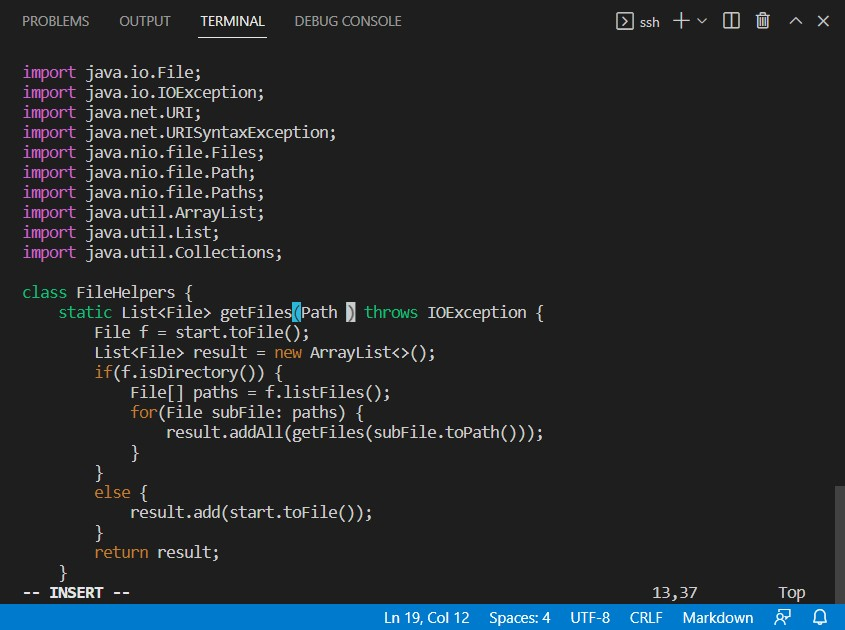
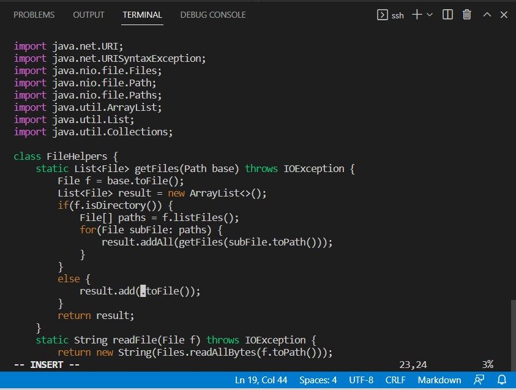

# Week 7 Lab Report
## Part 1: Vim key sequences
Changing the name of the start parameter and its uses to base: *`/start<Enter>dwibase<Esc>ndwibase<Esc>ndwibase<Esc>:w<Enter>`*

Search for the word "start": `/start<Enter>`

Delete the word "start" then enter insert mode to edit: `dwi`

Type in the word "base" then press Esc to switch back to normal mode: `base<Esc>`

Move to the next instance of "start": `n`

Delete it then enter insert mode to edit: `dwi`

Type in the word "base" then press Esc to switch back to normal mode: `base<Esc>`

Move to the last instance of "start": `n` 

Delete it then enter insert mode to edit: `dwi`

Type in the word "base" then press Esc to switch back to normal mode: `base<Esc>`

Save the change: `:w<Enter>`

## Part 2: To Vim or not to Vim 

* Start in Visual Studio Code and make the edit there, then scp the file to the remote server and run it: 1m53s
* Start already logged into a ssh session. Then, make the edit, then exit Vim and run bash test.sh: 1m19s

**Conclusion:** 

To edit the file I have *remotely* and then run it *remotely*, I would prefer logging in the ssh session and using Vim because I do not have to switch back and forth between the ssh and local session or to use `scp` to move file around, which can save me a bit of time and effort. When comparing to download the file to the local session to edit in VSCode, then `scp` it back to the ssh session to run it there, editting in the ssh session using Vim is definitely less time-consuming and more convinient.

However, in the case where I have the file *locally* and need to run it *remotely*, then I would prefer to edit it locally then move it to the ssh session using `scp` to run it there. The reason is that I am more familiar and comfortable with using the mouse to interact with the cursor than using Vim to move the cursor around. 

