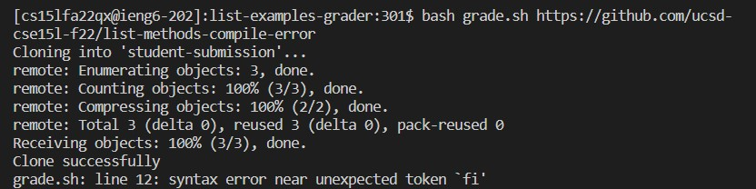

# Week 9 Lab Report: Grade Server
## Grade.sh code block
    set -e
    CPATH=".:lib/hamcrest-core-1.3.jar:lib/junit-4.13.2.jar"
    rm -rf student-submission
    git clone $1 student-submission
    echo "Clone successfully!"

    cp student-submission/ListExamples.java ./
    if [ $? -ne  0 ]
    then
        echo "Cannot find the correct java file in the submission"
        exit 1
    fi

    javac -cp $CPATH *.java
    if [ $? -ne  0 ]
    then
        echo "This submission cannot compile. Exitting"
        exit 1
    fi
    java -cp $CPATH org.junit.runner.JUnitCore TestListExamples

## Student Submission Corrected:

However, I keep getting this error for all 3 of my submission, which I think cause by this if statement block in grade.sh:

    cp student-submission/ListExamples.java ./
    if [ $? -ne  0 ]
        then
            echo "Cannot find the correct java file in the submission"
            exit 1
        fi
        
I use this if statement to check whether the java file in the submission has a correct name by check if the cp command can find and copy the correct file successfully or not. If the cp command does not run successfully (exit code != 0), then it means that the file either has a wrong name or does not exist. 

However, I do not know how to debug this as it seems like there is nothing wrong with the code. So I stuck on this step of the lab report at the moment. 

## Student Submission Compile Error:

## Student Submission Wrong File name:

